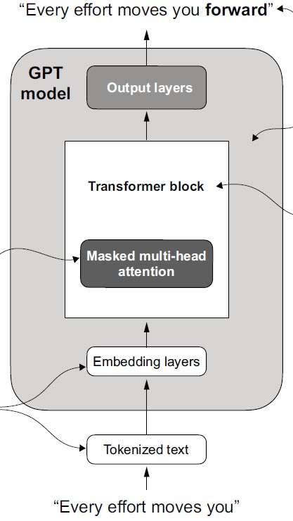
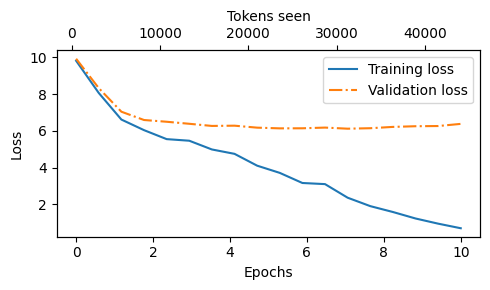

# 🧠 GPT from Scratch — Based on *"Build a Large Language Model (From Scratch)"*

This repository contains an implementation of a GPT-style language model from scratch, following the book **"Build a Large Language Model (From Scratch)"** by *Sebastian Raschka*. It includes training code, utilities, and a notebook to load GPT-2 weights from OpenAI.


[image credits](https://www.researchgate.net/publication/373352176_FLUID-GPT_Fast_Learning_to_Understand_and_Investigate_Dynamics_with_a_Generative_Pre-Trained_Transformer_Efficient_Predictions_of_Particle_Trajectories_and_Erosion)

---

## 📖 Project Overview

- **Goal**: Train a GPT-style transformer model from scratch on a real-world dataset.
- **Data**: [*The Verdict* by Alice Meynell](https://en.wikisource.org/wiki/The_Verdict) (public domain).
- **Framework**: PyTorch
- **Tokenizer**: GPT-2 BPE tokenizer via `tiktoken`
- **Model**: GPT-124M architecture defined from first principles
- **Training**: Simple training loop with loss tracking and validation
- **Extras**: Jupyter notebook to load and compare against GPT-2 weights from OpenAI

## 📁 Project Structure

```
.
├── GPT/ # GPT model definition and config
│ ├── GPT.py
│ └── GPT_CONFIG.py
├── data/ # Training data
│ └── the-verdict.txt
├── data_loader/ # Data preprocessing and batching
│ └── data_loader.py
├── loss/ # Custom loss functions for GPT training
│ └── loss.py
├── networks/ # Transformer block components (e.g., LayerNorm, attention)
│ └── networks.py
├── tools/ # Training loop and related utilities
│ └── program.py
├── utils/ # Utility functions
│ ├── utils.py
│ └── plot.py
├──gpt2.ipynb # Jupyter notebook
├── train.py # Main training script
├── README.md
└── requirements.txt
```

## 🚀 Getting Started

### 1. Clone the repository

```bash
git clone https://github.com/dimitri009/GPT.git
cd GPT
```

### 2. Install dependencies

I recommend using a virtual environment:
```
pip install -r requirements.txt
```
    This project uses torch, tiktoken, matplotlib, and numpy.

### 3. Prepare the data

The dataset is already included:

    data/the-verdict.txt

If you want to download a fresh copy:
```
wget https://en.wikisource.org/wiki/The_Verdict -O data/the-verdict.txt
```
### 4. Train the model
```
python train.py
```
Training will log loss over epochs, plot the curves at the end and save the plot in `fig/`. You can customize hyperparameters in `train.py` and `GPT/GPT_CONFIG.py`.
### 5. Load GPT-2 Weights (Optional)

To load pretrained OpenAI GPT-2 weights and compare against your model, use the notebook:
```
jupyter notebook gpt2.ipynb
```
## 🧪 Features

    Manual implementation of GPT-2 style attention layers

    Positional embeddings

    Token embeddings using tiktoken

    Train-validation splitting and loss plotting

    Option to use drop_last, stride, and context length control in dataloader

    GPT-2 weight loading notebook for comparison

### 📊 Example Output

Training loss and validation loss are plotted after training. Example:


### 📚 References

Book: [Build a Large Language Model (From Scratch) by Sebastian Raschka](https://www.manning.com/books/build-a-large-language-model-from-scratch)

Tokenizer: [OpenAI tiktoken](https://github.com/openai/tiktoken)

Dataset: [The Verdict - Wikisource](https://en.wikisource.org/wiki/The_Verdict)

## 🛠️ TODO

* Add script for classifier fine-tuning (e.g., sentiment classification, topic classification)
* Add script for instruction fine-tuning (e.g., Q&A or task completion using prompt–response format)


## 🧑‍💻 License

This project is released under the MIT License. See LICENSE for details.
## 🤝 Acknowledgements

* Sebastian Raschka for his detailed book and educational resources
* OpenAI for GPT-2 and the `tiktoken` tokenizer 
* [Project Gutenberg / Wikisource](https://www.gutenberg.org/) for public domain texts